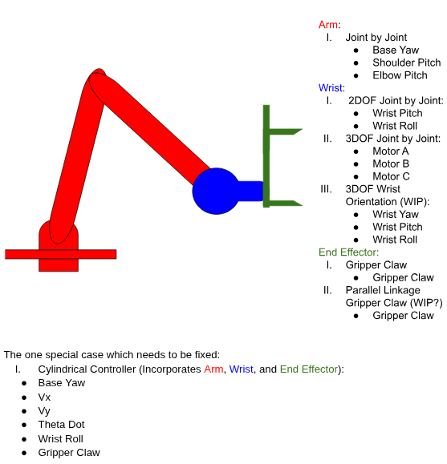
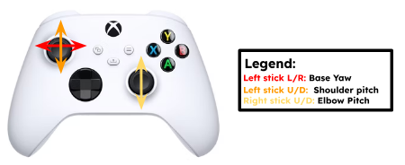
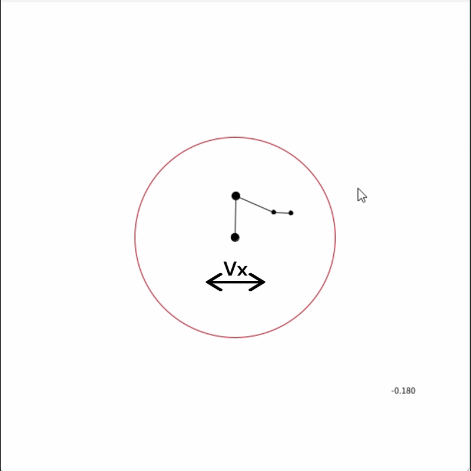
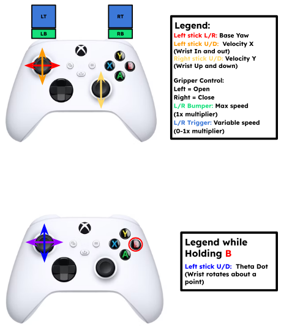
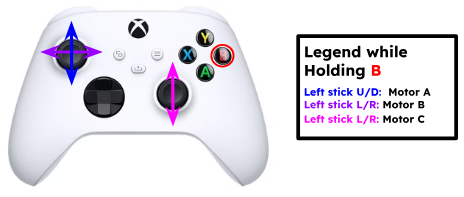
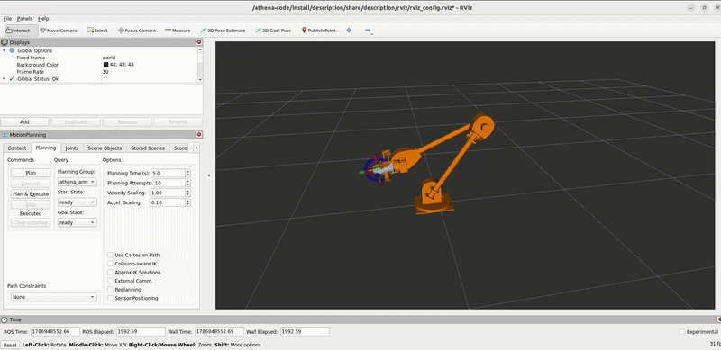

# UMD Loop's Arm software integration

## Current package list in arm subsystem:

<ul>
  <li><b>athena_arm_bringup</b>: contains launch files for ros2_control, teleop, rviz, and moveit with additional launch config files</li>
  <li><b>athena_arm_controllers</b>: contains custom arm controllers</li>
  <li><b>athena_arm_moveit</b>: contains athena arm moveit setup</li>
</ul>

---

### Launch Modes

`athena_arm.launch.py` accepts a `mode` argument that controls which nodes are started.

By default (`mode:=standalone`), all nodes run on a single machine. For competition, split across two machines using the `mode` argument:

- `standalone` (default): starts all nodes on one machine (control + joystick)
- `jetson`: starts only the control and hardware nodes, to be run on the rover
- `base_station`: starts only the joystick node, to be run on the base station

```bash
source install/setup.bash
ros2 launch arm_bringup athena_arm.launch.py
```

```bash
source install/setup.bash
ros2 launch arm_bringup athena_arm.launch.py mode:=jetson can_interface:=can1
```

```bash
source install/setup.bash
ros2 launch arm_bringup athena_arm.launch.py mode:=base_station
```

---

### Other Launch Parameters

#### Mock Hardware

Allows user to implement mock hardware components which will allow for virtual testing.

_Hardware:_

```bash
source install/setup.bash
ros2 launch arm_bringup athena_arm.launch.py use_mock_hardware:=false
```

_Mock (no hardware):_

```bash
source install/setup.bash
ros2 launch arm_bringup athena_arm.launch.py use_mock_hardware:=true
```

#### Simulation Mode (WIP)

Currently this repository does not support a fully implemented simulated hardware environment for the entire rover. The `use_sim` argument controls only the activation of RViz.

_Deactivates RViz:_

```bash
source install/setup.bash
ros2 launch arm_bringup athena_arm.launch.py use_sim:=false
```

#### Talon Deactivation

The Talon motor controllers overflow the CANBus, it can be helpful to debug with them off.

_Deactivates Talons:_

```bash
source install/setup.bash
ros2 launch arm_bringup athena_arm.launch.py deactivate_talon:=false
```

#### 3 Degrees of Freedom Mode

There are currently 2 variations of the wrist, 2DOF and 3DOF. Each require a different hardware configuration and load up different controllers as a result. Currently, 2DOF is the default implementation.

_3DOF Mode:_

```bash
source install/setup.bash
ros2 launch arm_bringup athena_arm.launch.py use_3dof:=true
```

#### CAN Interface

The Jetson currently uses a CANable to implement CAN, not its own CAN controller. This results in 2 can interfaces, can0 and can1, with the current working implementation using the latter.

_CAN Interface:_

```bash
source install/setup.bash
ros2 launch arm_bringup athena_arm.launch.py can_interface:=can1
```

### Arm Breakdown



### Testing

#### Manual Controller Testing

1. Make sure to plug in joystick controller
2. Open a new terminal
3. Switch to desired controller
   - Joint by Joint
   - Cylindrical
   - Joint Trajectory

##### ROS2 Controller: Arm - Joint by Joint



##### ROS2 Controller: Wrist - 2DOF - Joint by Joint


##### ROS2 Controller: End Effector - Gripper Claw - Joint by Joint

```bash
source install/setup.bash
ros2 service call /set_controller msgs/srv/SetController "{
  controller_names: [
    manual_arm_joint_by_joint_controller,
    manual_wrist_joint_by_joint_controller,
    manual_end_effector_gripper_claw_controller
  ]
}"
```

##### ROS2 Controller: Cylindrical (Work in Progress)

**Concept Demo:**



**Controls:**


```bash
source install/setup.bash
ros2 service call /set_controller msgs/srv/SetController "{
  controller_names: [
    manual_arm_cylindrical_controller
  ]
}"
```

##### ROS2 Controller: Wrist - 3DOF - Joint by Joint



```
source install/setup.bash
ros2 service call /set_controller msgs/srv/SetController "{
  controller_names: [
    manual_arm_joint_by_joint_controller,
    manual_wrist_joint_by_joint_controller,
    manual_end_effector_gripper_claw_controller
  ]
}"
```

#### Autonomous Controller Testing

##### Velocity Testing

1. Launch (Virtual Example):

```
./src/tools/scripts/virtual_can_setup.sh
source install/setup.bash
ros2 launch arm_bringup athena_arm.launch.py can_interface:=vcan0 use_mock_hardware:=true
```

2. Open a separate terminal and switch to arm velocity controller using the controller switching service:

```
source install/setup.bash
ros2 service call /set_controller msgs/srv/SetController "{controller_names: [arm_velocity_controller]}"
```

3. In this same terminal:

```bash
ros2 topic pub --rate 20 /arm_velocity_controller/commands std_msgs/msg/Float64MultiArray "{data: [0.05, 0.05, 0.0, 0.0, 0.0, 0.0, 0.0]}"
```

##### Joint Trajectory Testing

1. Launch (Virtual example):

```
./src/tools/scripts/virtual_can_setup.sh
source install/setup.bash
ros2 launch arm_bringup athena_arm.launch.py can_interface:=vcan0 use_mock_hardware:=true
```

2. Open a separate terminal and switch to joint trajectory controller using the controller switching service:

```
source install/setup.bash
ros2 service call /set_controller msgs/srv/SetController "{controller_names: [joint_trajectory_controller]}"
```

3. In this same terminal:

```bash
ros2 action send_goal /joint_trajectory_controller/follow_joint_trajectory control_msgs/action/FollowJointTrajectory "{ \
  trajectory:{ \
    joint_names: ['base_yaw', 'shoulder_pitch', 'elbow_pitch', 'wrist_pitch', 'wrist_roll', 'gripper_claw', 'actuator'], \
    points: [ \
      {positions: [0.0, -1.0, -2.0, -1.0, -0.16, 0.0, 0.0], time_from_start: {sec: 3, nanosec: 0}}, \
    ] \
  } \
}"
```

##### Virtual MoveIt Testing:



1. Launch:

```
./src/tools/scripts/virtual_can_setup.sh
source install/setup.bash
ros2 launch arm_bringup athena_arm.launch.py use_moveit:=true can_interface:=vcan0 use_mock_hardware:=true
```

2. Open a separate terminal and switch to joint trajectory controller using the controller switching service:

```
source install/setup.bash
ros2 service call /set_controller msgs/srv/SetController "{controller_names: [joint_trajectory_controller]}"
```

---
