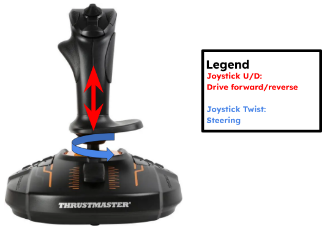

# UMD Loop's Drive software integration

## Current package list in drive subsystem:

<ul>
  <li><b>drive_bringup</b>: contains launch files and configuration for drive ros2_control, teleop, RViz, and controllers</li>
  <li><b>drive_controllers</b>: contains custom drive controllers</li>
</ul>

---

### Launch Modes

`athena_drive.launch.py` accepts a `mode` argument that controls which nodes are started.

By default (`mode:=standalone`), all nodes run on a single machine. For competition, split across two machines using the `mode` argument:

- `standalone` (default): starts all nodes on one machine (control + teleop)
- `jetson`: starts only the control and hardware nodes, to be run on the rover
- `base_station`: starts only the teleop nodes (joystick + teleop_twist_joy), to be run on the base station

```bash
source install/setup.bash
ros2 launch drive_bringup athena_drive.launch.py
```

```bash
source install/setup.bash
ros2 launch drive_bringup athena_drive.launch.py mode:=jetson
```

```bash
source install/setup.bash
ros2 launch drive_bringup athena_drive.launch.py mode:=base_station
```

---

### Other Launch Parameters

#### Mock Hardware

Allows user to implement mock hardware components which will allow for virtual testing.

_Hardware:_

```bash
source install/setup.bash
ros2 launch drive_bringup athena_drive.launch.py use_mock_hardware:=false
```

_Mock (no hardware):_

```bash
source install/setup.bash
ros2 launch drive_bringup athena_drive.launch.py use_mock_hardware:=true
```

#### Simulation Mode (WIP)

Currently this repository does not support a fully implemented simulated hardware environment for the entire rover. The `use_sim` argument controls only the activation of RViz.

_Deactivates RViz:_

```bash
source install/setup.bash
ros2 launch drive_bringup athena_drive.launch.py use_sim:=false
```

#### ODrive Deactivation

ODrives can cloud the CANBus just like the Talons. They are easier to moderate but this is a quick deactivation parameter.

_Deactivates ODrives:_

```bash
source install/setup.bash
ros2 launch drive_bringup athena_drive.launch.py deactivate_odrive:=true
```

#### Steering Config

The `steering_config` launch argument controls which ODrive steering joints are exposed to `ros2_control`.

- `rear` (default): exposes `steer_bl_joint` and `steer_br_joint`
- `front`: exposes `steer_fl_joint` and `steer_fr_joint`
- `all`: exposes all four steering joints

Use `steering_config:=all` for controllers that need both front and rear steering joints, such as `crab_steering_controller`, `double_ackermann_controller`, and `swerve_drive_controller`. If those controllers fail to switch on, check that all four `steer_*_joint/position` command interfaces are available.

```bash
source install/setup.bash
ros2 launch drive_bringup athena_drive.launch.py steering_config:=all
```

#### General Controls



#### CAN Interface

The Jetson currently uses a CANable to implement CAN, not its own CAN controller. This results in 2 can interfaces, can0 and can1, with the current working implementation using the latter.

_CAN Interface:_

```bash
source install/setup.bash
ros2 launch drive_bringup athena_drive.launch.py can_interface:=can1
```

### Testing

#### Manual Controller Testing

1. Make sure to plug in joystick controller
2. Open a new terminal
3. Switch to desired controller
   - Rear Ackermann
   - Front Ackermann
   - Double Ackermann
   - Ackermann Steering (ros2_control provided)

##### Rear Ackermann Controller:

```bash
source install/setup.bash
ros2 launch drive_bringup athena_drive.launch.py robot_controller:=rear_ackermann_controller
```

##### Front Ackermann Controller:

```bash
source install/setup.bash
ros2 launch drive_bringup athena_drive.launch.py robot_controller:=front_ackermann_controller
```

##### Double Ackermann Controller:

```bash
source install/setup.bash
ros2 launch drive_bringup athena_drive.launch.py robot_controller:=double_ackermann_controller steering_config:=all
```

##### Crab Steering Controller:

```bash
source install/setup.bash
ros2 launch drive_bringup athena_drive.launch.py robot_controller:=crab_steering_controller steering_config:=all
```

##### Ackermann Steering Controller:

```bash
source install/setup.bash
ros2 launch drive_bringup athena_drive.launch.py robot_controller:=ackermann_steering_controller
```

##### Power Gpio Controller:

```bash
ros2 topic pub --once /power_module_gpio_controller/commands control_msgs/msg/DynamicInterfaceGroupValues " 
interface_groups:
- drive_power_module
interface_values:
- interface_names:
  - kill_jetson
  values:
  - 1.0
"
```

##### LED Gpio Controller:

```bash
ros2 topic pub --once /drive_led_gpio_controller/commands control_msgs/msg/DynamicInterfaceGroupValues " 
interface_groups:
- drive_led
interface_values:
- interface_names:
  - red
  values:
  - 255.0
"
```

#### Autonomous Controller Testing

##### Velocity Testing

1. Switch to velocity controller using the controller switching service
2. In a new terminal:

```bash
ros2 topic pub /drive_velocity_controller/commands std_msgs/msg/Float64MultiArray "{data: [0.0, 0.0, 0.0, 0.0]}"
```
