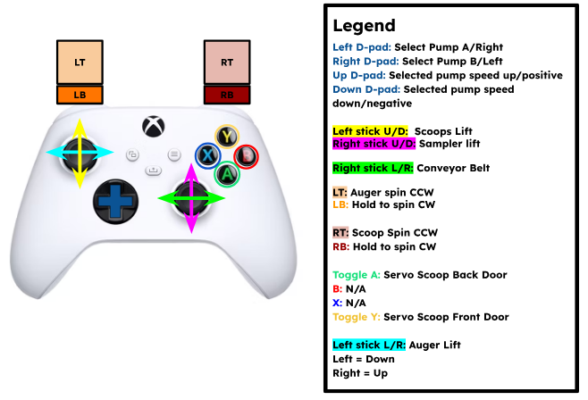

# UMD Loop's Science software integration

## Current package list in science subsystem:

<ul>
  <li><b>science_bringup</b>: contains launch files, controller configuration, service definitions, and joystick configuration for science</li>
  <li><b>science_controllers</b>: contains custom science controllers and related scripts</li>
</ul>

---

### Launch Modes

`athena_science.launch.py` accepts a `mode` argument that controls which nodes are started.

By default (`mode:=standalone`), all nodes run on a single machine. For competition, split across two machines using the `mode` argument:

- `standalone` (default): starts all nodes on one machine (control + joystick)
- `jetson`: starts only the control and hardware nodes, to be run on the rover
- `base_station`: starts only the joystick node, to be run on the base stati

`athena_science.launch.py` currently launches the science subsystem.

```bash
source install/setup.bash
ros2 launch science_bringup athena_science.launch.py
```

```bash
source install/setup.bash
ros2 launch science_bringup athena_science.launch.py mode:=jetson can_interface:=can1
```

```bash
source install/setup.bash
ros2 launch science_bringup athena_science.launch.py mode:=base_station
```

---

### Other Launch Parameters

#### Mock Hardware

Allows user to implement mock hardware components which will allow for virtual testing.

_Hardware:_

```bash
source install/setup.bash
ros2 launch science_bringup athena_science.launch.py use_mock_hardware:=false
```

_Mock (no hardware):_

```bash
source install/setup.bash
ros2 launch science_bringup athena_science.launch.py use_mock_hardware:=true
```

#### Talon Deactivation

The Talon motor controllers overflow the CANBus, it can be helpful to debug with them off.

_Deactivates Talons:_

```bash
source install/setup.bash
ros2 launch science_bringup athena_science.launch.py deactivate_talon:=true
```

#### Robot Controller

Specify desired ROS2 controller. Currently, it is only the manual science controller.

_Science Controller:_

```bash
source install/setup.bash
ros2 launch science_bringup athena_science.launch.py robot_controller:=science_controller
```

#### CAN Interface

The Jetson currently uses a CANable to implement CAN, not its own CAN controller. This results in 2 can interfaces, can0 and can1, with the current working implementation using the latter.

_CAN Interface:_

```bash
source install/setup.bash
ros2 launch science_bringup athena_science.launch.py can_interface:=can0
```

### Testing

#### Manual Controller Testing

1. Make sure to plug in joystick controller
2. Open a new terminal
3. Switch to desired controller
   - Manual Science Controller

##### ROS2 Controller: Science


---
